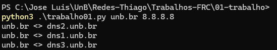
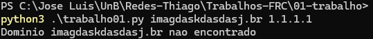
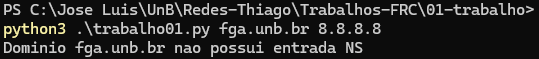
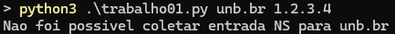

<!-- o qual sistema operacional foi usado na construção do sistema;
o qual ambiente de desenvolvimento foi usado;
o como construir a aplicação;
o como executar a aplicação;
o quais são as telas (instruções de uso);
o quais são as limitações conhecidas  -->

# Trabalho 1 FRC

## Integrantes

- Heitor Marques Simões Barbosa - 202016462
- José Luís Ramos Teixeira      - 190057858
- Leonardo Goncalves Machado    - 211029405
- Zenilda Pedrosa Vieira        - 212002907

## SO Usado
O sistema foi criado e testado usando a versão do Ubuntu "22.04.4 LTS (Jammy Jellyfish)"

## Ambiente de Desenvolvimento
Para o ambiente de desenvolvimento foi utilizado python 3.11.5

</br>

## Como o Código foi construído
O código foi construído em Python e utiliza bibliotecas padrão para comunicação via socket UDP e manipulação de estruturas de dados binárias. Ele é dividido em três principais funções:

1.  ```bash
    def cria_pacote(nome):
    ```

    Esta função é responsável por criar o pacote DNS de acordo com as especificações do trabalho. Ela gera um número aleatório de 16 bits para identificar a transação, configura as flags de consulta, adiciona o nome do domínio e define o tipo de consulta como NS (Servidor de Nomes).

</br>

2.  ```bash
    def envia_e_recebe(busca, dns_server):
    ```
    Esta função envia o pacote DNS para o servidor DNS especificado e aguarda a resposta. Ela faz até três tentativas de envio, com timeout de 2 segundos por cada resposta. Se não houver resposta após três tentativas, retorna None.

</br>

3.  ```bash
    def parse_resposta(resposta, hostname):
    ```
    Esta função analisa a resposta recebida do servidor DNS. Ela verifica o cabeçalho da resposta para determinar se houve sucesso na consulta ou se houve algum erro. Em caso do DNS indica uma entrada NS, chama a função do parse_domain() que extrai o nome do servidor autoritativo da resposta.

</br>

4.  ```bash
    def parse_domain(resposta, offset, dominios):
    ```

    A função `parse_domain` analisa os nomes de domínio na resposta DNS. Ela entra em um loop para percorrer byte por byte da resposta. Se encontrar um byte zero, termina o loop e retorna o domínio completo, caso encontre um byte maior ou igual a 192 (indicando um ponteiro), ajusta o offset e chama recursivamente a função. 

    Se encontrar um byte que não seja zero nem ponteiro, adiciona o componente do domínio à lista e avança o offset.
    
    No final, retorna o domínio completo como uma string.

</br>
</br>

Por fim teremos a main do código onde chamaremos as funções:

```bash
args = sys.argv[1:]
dominio = args[0]  
dns_server = args[1]  
```
- `dominio` obtém o nome do domínio a ser consultado a partir dos argumentos da linha de comando
- `dns_server` obtém o endereço IP do servidor DNS a ser consultado a partir dos argumentos da linha de comando


```bash
pacote = cria_pacote(dominio)
resposta = envia_e_recebe(pacote, dns_server) 
parse_resposta(resposta, dominio)
```
No trecho acima ele chama a função para criação o pacote DNS para a consulta do domínio especificado, com o pacote criado envia o pacote DNS para o servidor DNS e aguarda a resposta, por fim analisa a resposta recebida do servidor DNS e exibe o resultado da consulta.

</br>
</br>

## Executando o Código
Para executar o codigo deverá executar o arquivo python passando 2 argumentos, o nome do domínio e o ip do servidor DNS

Como o exemplo abaixo:
```bash
python3 ./trabalho01.py unb.br 8.8.8.8
```

</br>
</br>

## Exemplos de Interação

### Exemplo 1 (Resolução bem sucedida)
```bash
python3 ./trabalho01.py unb.br 8.8.8.8
```



### Exemplo 2 (Resolução com falha: nome de domínio não existe)
```bash
python3 ./trabalho01.py imagdaskdasdasj.br 1.1.1.1
```



### Exemplo 3 (Resolução com falha: domínio não possui entrada NS)
```bash
python3 ./trabalho01.py fga.unb.br 8.8.8.8
```



### Exemplo 4 (Resolução com falha: servidor não existe/não atendeu)
```bash
python3 ./trabalho01.py unb.br 1.2.3.4
```



</br>
</br>

## Limitações Conhecidas
- O código oferece suporte apenas para consultas em servidores DNS para obter registros NS (Name Server)
- O código não consegue ser rodado utilizando a rede da UnB. Redes públicas, como as de uma universidade, geralmente podem apresentar algumas limitações:

    1. `Firewalls e restrições de rede:` Firewalls e políticas de segurança podem bloquear o tráfego UDP na porta 53, impedindo a comunicação com servidores DNS externos.

    2. `Bloqueio de tráfego externo:` Redes públicas podem bloquear o tráfego para servidores DNS externos, como o Google DNS (8.8.8.8), o que pode impedir o cliente DNS de enviar consultas.

    3. `Configurações de rede específicas:` Configurações de rede específicas da instituição podem incluir políticas de firewall, filtragem de pacotes e restrições de porta que afetam a comunicação UDP.

    4. `Problemas de conectividade ou latência:` Problemas de conectividade, como roteamento inadequado ou congestionamento de rede, podem causar falhas na comunicação com servidores DNS externos.


