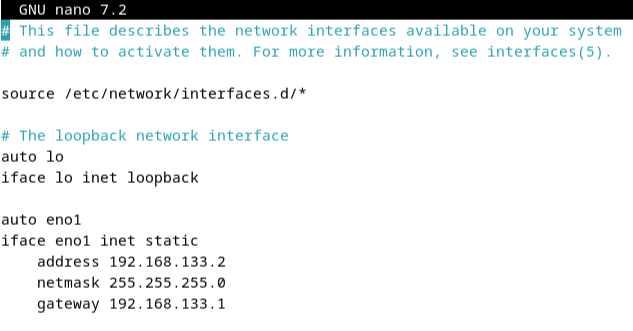
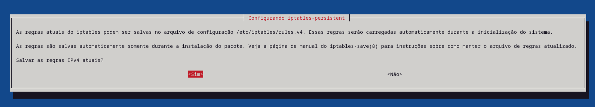
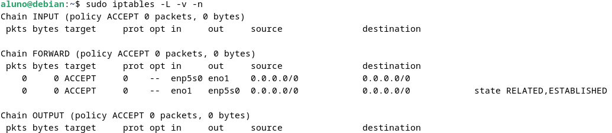
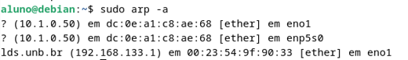
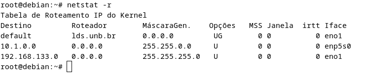
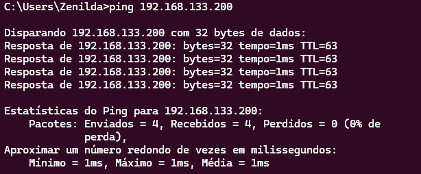
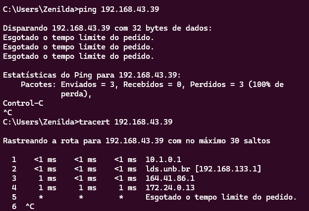
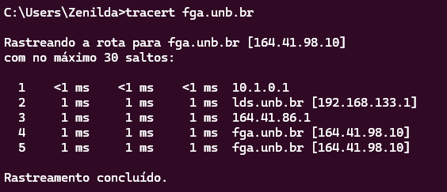
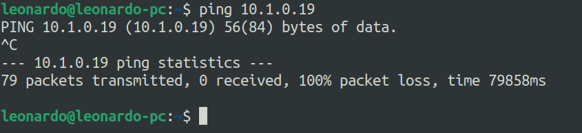

<!-- 
o qual sistema operacional foi usado na construção do sistema;
o quais foram as aplicações demandadas na implementação da rede LAN;
o como implementar a rede LAN;
o como validar a configuração da rede LAN;
o quais são as limitações conhecidas  -->

# Trabalho 2 FRC

- Data: 31/05/2024

<a name="top0"></a>

## Sumário
- [Trabalho 2 FRC](#trabalho-2-frc)
  - [Sumário](#sumário)
  - [1. Integrantes](#1-integrantes)
  - [2. Objetivo](#2-objetivo)
  - [3. SO Usado](#3-so-usado)
  - [4. Principais ferramentas utilizadas](#4-principais-ferramentas-utilizadas)
  - [5. Implementação](#5-implementação)
    - [5.1. Interface WAN](#51-interface-wan)
      - [5.1.1. Configuração da Interface WAN:](#511-configuração-da-interface-wan)
      - [5.1.2. Reinicialização da Interface](#512-reinicialização-da-interface)
      - [5.1.3. Verificação do endereço configurado](#513-verificação-do-endereço-configurado)
    - [5.2. Interface LAN](#52-interface-lan)
      - [5.2.1. Configuração da Interface LAN](#521-configuração-da-interface-lan)
      - [5.2.2. Reinicialização da Interface](#522-reinicialização-da-interface)
      - [5.2.3. Verificação do endereço configurado](#523-verificação-do-endereço-configurado)
    - [5.3. NAT](#53-nat)
      - [5.3.1. Habilitação do Roteamento IP](#531-habilitação-do-roteamento-ip)
      - [5.3.2. Configuração do iptables para NAT](#532-configuração-do-iptables-para-nat)
      - [5.3.3. Salvar a Configuração do iptables](#533-salvar-a-configuração-do-iptables)
    - [5.4. Serviço DHCP](#54-serviço-dhcp)
      - [5.4.1. Instalação do Servidor DHCP](#541-instalação-do-servidor-dhcp)
      - [5.4.2. Configuração do Servidor DHCP](#542-configuração-do-servidor-dhcp)
      - [5.4.3. Configuração de uma Lease Estática](#543-configuração-de-uma-lease-estática)
      - [5.4.4. Definição da Interface para o Servidor DHCP](#544-definição-da-interface-para-o-servidor-dhcp)
      - [5.4.5. Reinicialização do Serviço DHCP](#545-reinicialização-do-serviço-dhcp)
      - [5.4.6. Verificação das Leases DHCP](#546-verificação-das-leases-dhcp)
  - [6. Testes e Validação](#6-testes-e-validação)
    - [6.1 Validar Conectividade WAN e LAN](#61-validar-conectividade-wan-e-lan)
      - [6.1.1. Conectividade com o gateway](#611-conectividade-com-o-gateway)
      - [6.1.2. Teste de conectividade entre equipamentos da rede privada e equipamentos situados na rede de saída do gateway](#612-teste-de-conectividade-entre-equipamentos-da-rede-privada-e-equipamentos-situados-na-rede-de-saída-do-gateway)
      - [6.1.3. Teste de conectividade entre equipamentos da rede privada e equipamentos na rede externa](#613-teste-de-conectividade-entre-equipamentos-da-rede-privada-e-equipamentos-na-rede-externa)
    - [6.2. Validar NAT](#62-validar-nat)
      - [6.2.1. Testar Tradução de Endereços](#621-testar-tradução-de-endereços)
    - [6.3. Isolamento de Segmento](#63-isolamento-de-segmento)
  - [7. Limitações Conhecidas](#7-limitações-conhecidas)


<a name="top1"></a>

## 1. Integrantes

- Heitor Marques Simões Barbosa ..... 202016462
- José Luís Ramos Teixeira ..................... 190057858
- Leonardo Goncalves Machado ......... 211029405
- Zenilda Pedrosa Vieira ......................... 212002907

<a name="top2"></a>

## 2. Objetivo

Esse trabalho tem como principal objetivo exercitar conceitos de configuração de redes de computadores. Utilizando equipamentos do LDS, foi criado e testado um passo a passo para configurar uma rede privada LAN, conectada a um roteador com interface de rede WAN e um gateway.

<a name="top3"></a>

## 3. SO Usado

O sistema operacional utilizado foi o Debian, versão 12.5.0.

<a name="top4"></a>

## 4. Principais ferramentas utilizadas

A seguir, listamos as principais ferrramentas e os aquivos de configuração que foram alterados.

* Configuração de rede: 
  * `ip addr`, `nano`, `cat`
  * `/etc/network/interfaces`
  * `/etc/sysctl.conf`
* Configuração de NAT: 
  * `iptables`
* Configuração de DHCP: 
  * `/etc/default/isc-dhcp-server`
  * `/etc/dhcp/dhcpd.conf` 

[(Sumário - voltar ao topo)](#top0)

<a name="top5"></a>

## 5. Implementação

Para implementar a configuração da rede em estudo (figura 1), considerou-se como base uma rede de acesso de segmento **192.168.133.0/24** (rede cabeada do LDS), com gateway em **192.168.133.1**. Assim, definimos:
- Rede de Acesso: 192.168.133.0/24
- Gateway da Rede de Acesso: 192.168.133.1
- Rede LAN: 10.1.0.0/16

<br>
<center>
<div style="border: 1px solid black; border-radius: 10px; box-shadow: -5px -5px 15px rgba(0, 0, 0, 0.5); display: inline-block;">
  
</div>
<div >
<font size="2"><p style="text-align: center"><b>Figura 1 - Configuração da rede</b></p></font>
</div>
</center>
<br>


Para começar, desativamos os serviços de suporte às configurações de rede para realizar a configuração manual das interfaces de rede (também chamada de configuração estática). Para isso, utilizamos o seguinte comando:

```bash
sudo service NetworkManager stop
```

Com o comando 
```bash
sudo service NetworkManager status
```
verificamos que o serviço foi desativado, como mostra a figura 2.

<br>
<center>
<div style="border: 1px solid black; border-radius: 10px; box-shadow: -5px -5px 15px rgba(0, 0, 0, 0.5); display: inline-block;" >
  
</div>
<div >
<font size="2"><p style="text-align: center"><b>Figura 2 - Serviço NetworkManager desativado</b></p></font>
</div>
</center>
<br>

Em seguida, verificamos quais interfaces de rede estavam instaladas no computador e como estavam seus respectivos IPs, usando o comando:

```bash
ip addr
```

Com a resposta desse comando (figura 3) verificamos que a interface `eno1` estava configurada com um IP da rede de acesso **192.168.133.181** e a interface `enp5s0` não estava configurada ainda.

<br>
<center>
<div style="border: 1px solid black; border-radius: 10px; box-shadow: -5px -5px 15px rgba(0, 0, 0, 0.5); display: inline-block;">
  
</div>
<div >
<font size="2"><p style="text-align: center"><b>Figura 3 - Serviço NetworkManager desativado</b></p></font>
</div>
</center>
<br>

<a name="top5.1"></a>

### 5.1. Interface WAN

Iniciamos a configuração da nossa rede configurando um roteador em que a interface de rede WAN assumisse um IP da rede de acesso **192.168.133.0/24**. 

<br>

#### 5.1.1. Configuração da Interface WAN:

A princípio, editamos o arquivo `/etc/network/interfaces`:

```bash
sudo nano /etc/network/interfaces
```

Adicionamos a configuração da interface WAN para colocar essa interface configurável de forma estática, assumindo `eno1` e o endereço IP **192.168.133.2** (figura 4):

```plaintext
auto eno1
iface eno1 inet static
    address 192.168.133.2
    netmask 255.255.255.0
    gateway 192.168.133.1
```

<br>
<center>
<div style="border: 1px solid black; border-radius: 10px; box-shadow: -5px -5px 15px rgba(0, 0, 0, 0.5); display: inline-block;">
  
</div>
<div >
<font size="2"><p style="text-align: center"><b>Figura 4 - Edição do arquivo '/etc/network/interfaces'</b></p></font>
</div>
</center>
<br>

Como mostra a Figura 5, conferimos se as alterações foram salvas com o comando:

```bash
cat /etc/network/interfaces
```

<br>
<center>
<div style="border: 1px solid black; border-radius: 10px; box-shadow: -5px -5px 15px rgba(0, 0, 0, 0.5); display: inline-block;">
  
</div>
<div >
<font size="2"><p style="text-align: center"><b>Figura 5 - Arquivo '/etc/network/interfaces' editado</b></p></font>
</div>
</center>
<br>

#### 5.1.2. Reinicialização da Interface

Para que as alterações tivessem efeito, reiniciamos a interface com o seguinte comando:

```bash
sudo ifdown eno1 && sudo ifup eno1
```

<br>

#### 5.1.3. Verificação do endereço configurado

E por fim, para verificar se o endereço foi configurado corretamente, usamos o comando (figura 6):

```bash
sudo ip addr show
```

<br>
<center>
<div style="border: 1px solid black; border-radius: 10px; box-shadow: -5px -5px 15px rgba(0, 0, 0, 0.5); display: inline-block;">
  
</div>
<div >
<font size="2"><p style="text-align: center"><b>Figura 6 - Interface de rede eno1 com IP alterado</b></p></font>
</div>
</center>
<br>

Observamos que a interface `eno1` agora está configurada com um IP da rede de acesso **192.168.133.2** conforme definimos.

[(Sumário - voltar ao topo)](#top0)

<a name="top5.2"></a>

### 5.2. Interface LAN

Continuamos a configuração considerando que a rede LAN provida através desse trabalho fosse uma subrede /16 usando as faixas de IP reservadas na Internet para esse tipo de configuração. Escolhemos, portanto, a subrede **10.1.0.0/16**. 

<br>

#### 5.2.1. Configuração da Interface LAN

Da mesma forma feita anteriormente, editamos o arquivo `/etc/network/interfaces`:

```bash
sudo nano /etc/network/interfaces
```

Adicionamos a configuração da interface LAN para colocar essa interface configurável de forma estática, assumindo `enp5s0` e o endereço IP **10.1.0.1** (figura 7):

```plaintext
auto enp5s0
iface enp5s0 inet static
    address 10.1.0.1
    netmask 255.255.0.0
```

<br>
<center>
<div style="border: 1px solid black; border-radius: 10px; box-shadow: -5px -5px 15px rgba(0, 0, 0, 0.5); display: inline-block;">
  
</div>
<div >
<font size="2"><p style="text-align: center"><b>Figura 7 - Edição do arquivo '/etc/network/interfaces'</b></p></font>
</div>
</center>
<br>

Novamente conferimos se as alterações foram salvas com o comando (figura 8):

```bash
cat /etc/network/interfaces
```

<br>
<center>
<div style="border: 1px solid black; border-radius: 10px; box-shadow: -5px -5px 15px rgba(0, 0, 0, 0.5); display: inline-block;">
  
</div>
<div >
<font size="2"><p style="text-align: center"><b>Figura 8 - Arquivo '/etc/network/interfaces' editado</b></p></font>
</div>
</center>
<br>

#### 5.2.2. Reinicialização da Interface

Reiniciamos a interface com o seguinte comando:

```bash
sudo ifdown enp5s0 && sudo ifup enp5s0
```

<br>

#### 5.2.3. Verificação do endereço configurado

Para verificar se o endereço foi configurado corretamente, usamos o comando:

```bash
sudo ip addr show
```

Na figura 9, podemos observar a resposta desse comando:

<br>
<center>
<div style="border: 1px solid black; border-radius: 10px; box-shadow: -5px -5px 15px rgba(0, 0, 0, 0.5); display: inline-block;">
  
</div>
<div >
<font size="2"><p style="text-align: center"><b>Figura 9 - Interface de rede enp5s0 com IP alterado e conectada</b></p></font>
</div>
</center>
<br>

Observamos que a interface `enp5s0` agora está conectada e configurada com um IP da subrede LAN **10.1.0.1** conforme definimos.

[(Sumário - voltar ao topo)](#top0)

<a name="top5.3"></a>

### 5.3. NAT

Para realizar o mapeamento entre o IP da rede de acesso e os IPs da rede privada LAN criada foi utilizado o serviço de NAT, conforme descrito a seguir.

<br>

#### 5.3.1. Habilitação do Roteamento IP

Editamos o arquivo `/etc/sysctl.conf`:

```bash
sudo nano /etc/sysctl.conf
```

Removemos o comentário da seguinte linha para ativar o encaminhamento de pacotes IP (_IP forwarding_), conforme mostra a figura 10:

```plaintext
net.ipv4.ip_forward=1
```

<br>
<center>
<div style="border: 1px solid black; border-radius: 10px; box-shadow: -5px -5px 15px rgba(0, 0, 0, 0.5); display: inline-block;">
  
</div>
<div >
<font size="2"><p style="text-align: center"><b>Figura 10 - Edição do arquivo /etc/sysctl.conf</b></p></font>
</div>
</center>
<br>

Aplicamos a mudança conforme a figura 11:

```bash
sudo sysctl -p
```

<br>
<center>
<div style="border: 1px solid black; border-radius: 10px; box-shadow: -5px -5px 15px rgba(0, 0, 0, 0.5); display: inline-block;">
  
</div>
<div >
<font size="2"><p style="text-align: center"><b>Figura 11 - Aplicação do roteamento IP</b></p></font>
</div>
</center>
<br>

#### 5.3.2. Configuração do iptables para NAT

Após a configuração da interface de saída WAN `eno1` e a configuração da interface interna LAN `enp5s0` sem DHCP (ainda), realizamos a limpeza de eventuais regras de *firewall* presente no equipamento:

```bash
sudo iptables --flush
sudo iptables --table nat --flush
sudo iptables --delete-chain
sudo iptables --table nat --delete-chain
sudo iptables -t nat -A POSTROUTING -o eno1 -j MASQUERADE
sudo iptables -A FORWARD -i enp5s0 -o eno1 -j ACCEPT
sudo iptables -A FORWARD -i eno1 -o enp5s0 -m state --state RELATED,ESTABLISHED -j ACCEPT
```

Esses comandos configuram o NAT e as regras de firewall necessárias para permitir que os dispositivos na LAN `enp5s0` acessem a internet através da interface WAN (`eno1`). A limpeza das regras de firewall garante que não existam regras conflitantes, enquanto as regras de NAT e encaminhamento permitem o tráfego entre as duas interfaces, proporcionando a funcionalidade de roteamento e compartilhamento de conexão com a internet.

<br>

#### 5.3.3. Salvar a Configuração do iptables

Em seguida, salvamos as configurações efetivadas para que fossem aplicadas no reboot:  

```bash
sudo apt-get install iptables-persistent
sudo netfilter-persistent save
sudo netfilter-persistent reload
```

E confirmamos o salvamento como mostra a figura 12.

<br>
<center>
<div style="border: 1px solid black; border-radius: 10px; box-shadow: -5px -5px 15px rgba(0, 0, 0, 0.5); display: inline-block;">
  
</div>
<div >
<font size="2"><p style="text-align: center"><b>Figura 12 - Configuração do iptables-persistent</b></p></font>
</div>
</center>
<br>

Para conferir as configurações feitas utilizamos o comando abaixo e obtemos o resultado da figura 13.

```bash
sudo iptables -L -v -n
```

<br>
<center>
<div style="border: 1px solid black; border-radius: 10px; box-shadow: -5px -5px 15px rgba(0, 0, 0, 0.5); display: inline-block;">
  
</div>
<div >
<font size="2"><p style="text-align: center"><b>Figura 13 - Configuração do iptables</b></p></font>
</div>
</center>
<br>

<a name="top5.4"></a>

### 5.4. Serviço DHCP

Após a configuração do serviço NAT, implementamos o serviço de DHCP para prover as configurações de redes para os clientes da LAN recém criada.

<br>

#### 5.4.1. Instalação do Servidor DHCP

Primeiramente, instalamos o servidor DHCP com os seguintes comandos:

```bash
sudo apt-get update
sudo apt-get install isc-dhcp-server
```

<br>

#### 5.4.2. Configuração do Servidor DHCP

Depois editamos o arquivo `/etc/dhcp/dhcpd.conf`:

```bash
sudo nano /etc/dhcp/dhcpd.conf
```

Adicionamos a configuração para a rede LAN, partindo do princípio que há um servidor DNS provido no IP **192.168.133.1** (figura 14):

```plaintext
option subnet-mask 255.255.0.0;
option broadcast-address 10.1.0.255;
option routers 10.1.0.1;
option domain-name-servers 192.168.133.1;

subnet 10.1.0.0 netmask 255.255.0.0 {
    range 10.1.0.10 10.1.0.100;
}
```

<br>
<center>
<div style="border: 1px solid black; border-radius: 10px; box-shadow: -5px -5px 15px rgba(0, 0, 0, 0.5); display: inline-block;">
  
</div>
<div >
<font size="2"><p style="text-align: center"><b>Figura 14 - Arquivo /etc/dhcp/dhcpd.conf editado</b></p></font>
</div>
</center>
<br>

Para conferir se a alteração do arquivo `/etc/dhcp/dhcpd.conf` foi feita corretamente, usamos o seguinte comando:

```bash
sudo dhcpd -t
```

Nenhuma mensagem de erro foi obtida na resposta, comprovando que não houve erros de digitação (figura 15).

<br>
<center>
<div style="border: 1px solid black; border-radius: 10px; box-shadow: -5px -5px 15px rgba(0, 0, 0, 0.5); display: inline-block;">
  
</div>
<div >
<font size="2"><p style="text-align: center"><b>Figura 15 - Resposta do comando sudo dhcpd -t</b></p></font>
</div>
</center>
<br>

#### 5.4.3. Configuração de uma Lease Estática

Para uma determinada máquina de testes de configurações da LAN criada, vinculamos o endereço IP **10.1.0.50** de forma que aquele equipamento receba sempre esse mesmo endereço como oferta do servidor DHCP. Para isso, adicionamos ao arquivo `/etc/dhcp/dhcpd.conf` as linhas de comando a seguir:

```plaintext
host test-machine {
   hardware ethernet DC:0E:A1:C8:AE:68; 
   fixed-address 10.1.0.50;
}
```

A figura 16 mostra as alterações feitas.

<br>
<center>
<div style="border: 1px solid black; border-radius: 10px; box-shadow: -5px -5px 15px rgba(0, 0, 0, 0.5); display: inline-block;">
  
</div>
<div >
<font size="2"><p style="text-align: center"><b>Figura 16 - Arquivo /etc/dhcp/dhcpd.conf editado</b></p></font>
</div>
</center>
<br>


#### 5.4.4. Definição da Interface para o Servidor DHCP

Editamos o arquivo `/etc/default/isc-dhcp-server`:

```bash
sudo nano /etc/default/isc-dhcp-server
```

Modificando a linha a seguir para sempre disparar o serviço DHCP somente na interface `enp5s0` (figura 17):

```plaintext
INTERFACESv4="enp5s0"   
```

<br>
<center>
<div style="border: 1px solid black; border-radius: 10px; box-shadow: -5px -5px 15px rgba(0, 0, 0, 0.5); display: inline-block;">
  
</div>
<div >
<font size="2"><p style="text-align: center"><b>Figura 17 - Arquivo /etc/default/isc-dhcp-server editado</b></p></font>
</div>
</center>
<br>


#### 5.4.5. Reinicialização do Serviço DHCP

Após todas as configurações feitas, reinicializamos o servidor para que as alterações tivessem efeito.

```bash
sudo /etc/init.d/isc-dhcp-server start
```

<br>

#### 5.4.6. Verificação das Leases DHCP

Para conferir as leases providas pelo servidor DHCP, visualizamos o arquivo de leases em `/var/lib/dhcp/dhcpd.leases`:

```bash
cat /var/lib/dhcp/dhcpd.leases
```

E a resposta desse comando foi o ilustrado na figura 18, o que mostra a concessão do IP **10.1.0.10** atribuído a um cliente da subrede criada.

<br>
<center>
<div style="border: 1px solid black; border-radius: 10px; box-shadow: -5px -5px 15px rgba(0, 0, 0, 0.5); display: inline-block;">
  
</div>
<div >
<font size="2"><p style="text-align: center"><b>Figura 18 - Lease provida pelo servidor DHCP</b></p></font>
</div>
</center>
<br>


<a name="top6"></a>

## 6. Testes e Validação

Foi gerada uma lista de testes necessários para validar essa solução.
- Validar a conectividade WAN e LAN
- Verificar a tradução de endereço (NAT)
- Verificar o isolamento de segmento (NAT) da rede WAN.


Para iniciar os testes conectamos a máquina de teste  de MAC Address **DC:0E:A1:C8:AE:68** no switch utilizando sua interface Ethernet. O computador de teste estava configurado para DHCP automático.

Nessa máquina de teste, abrimos um prompt de comando e digitamos o comando:

```bash
ipconfig
```

O resultado foi o obtido na figura 19 que mostra que a máquina recebeu um IP preferencial **10.1.0.50** conforme a configuração que realizamos. O resultado mostra também:
- Servidor DHCP: **10.1.0.1**
- Gateway padrão: **10.1.0.1**
- Servidor DNS: **192.168.133.1**

<br>
<center>
<div style="border: 1px solid black; border-radius: 10px; box-shadow: -5px -5px 15px rgba(0, 0, 0, 0.5); display: inline-block;">
  
</div>
<div >
<font size="2"><p style="text-align: center"><b>Figura 19 - Configuração do IP da máquina de teste</b></p></font>
</div>
</center>
<br>

Depois voltamos para o servidor e utilizamos o comando abaixo para exibir a tabela ARP (Address Resolution Protocol) do sistema, que mapeia endereços IP para endereços MAC na rede local:

```bash
sudo arp -a
```

Obtivemos a resposta ilustrada na figura 20 abaixo:

<br>
<center>
<div style="border: 1px solid black; border-radius: 10px; box-shadow: -5px -5px 15px rgba(0, 0, 0, 0.5); display: inline-block;">
  
</div>
<div >
<font size="2"><p style="text-align: center"><b>Figura 20 - Resposta do comando sudo arp -a</b></p></font>
</div>
</center>
<br>

Verificamos que o endereço IP **10.1.0.50** foi resolvido para o MAC Address da máquina de teste, mostrando que há conectividade entre a máquina das interfaces configuradas e a máquina de teste.

<br>

<a name="top6.1"></a>

### 6.1 Validar Conectividade WAN e LAN


Através do comando `netstat` podemos observar a tabela de roteamento do kernel, que mostra como os pacotes de rede são encaminhados em um sistema. A tabela de roteamento inclui informações sobre destinos de rede, máscaras de rede, gateways e interfaces de rede associadas. 

```bash
sudo netstat -r
```

Na figura 21, é possível confirmar que as rotas configuradas estão ativas (`Opções = U`). 
<br>
<center>
<div style="border: 1px solid black; border-radius: 10px; box-shadow: -5px -5px 15px rgba(0, 0, 0, 0.5); display: inline-block;">
  
</div>
<div >
<font size="2"><p style="text-align: center"><b>Figura 21 - Resposta do comando sudo arp -a</b></p></font>
</div>
</center>
<br>

#### 6.1.1. Conectividade com o gateway

A partir do equipamento de teste da rede privada verificamos a conectividade WAN enviando pacotes ICMP para o gateway com o seguinte comando:

```bash
ping 192.168.133.1
```

Obtivemos a seguinte resposta (figura 22) comprovando a conexão entre um equipamento da rede privada e o gateway da rede WAN.

<br>
<center>
<div style="border: 1px solid black; border-radius: 10px; box-shadow: -5px -5px 15px rgba(0, 0, 0, 0.5); display: inline-block;">

</div>
<div >
<font size="2"><p style="text-align: center"><b>Figura 22 - Teste de conexão com o gateway da rede WAN</b></p></font>
</div>
</center>
<br>

Testamos também a conexão LAN com o gateway da rede privada como mostra a figura 23.

<br>
<center>
<div style="border: 1px solid black; border-radius: 10px; box-shadow: -5px -5px 15px rgba(0, 0, 0, 0.5); display: inline-block;">
  
</div>
<div >
<font size="2"><p style="text-align: center"><b>Figura 23 - Teste de conexão com o gateway da rede LAN</b></p></font>
</div>
</center>
<br>

#### 6.1.2. Teste de conectividade entre equipamentos da rede privada e equipamentos situados na rede de saída do gateway

Também tentamos enviar pacotes ICMP a partir da máquina de teste para algum outro computador que estava conectado à rede WAN para conferir as configurações de roteamento.

```bash
ping 192.168.133.200
```

Obtivemos a seguinte resposta (figura 24) mostrando a conexão bem sucedida.

<br>
<center>
<div style="border: 1px solid black; border-radius: 10px; box-shadow: -5px -5px 15px rgba(0, 0, 0, 0.5); display: inline-block;">

</div>
<div >
<font size="2"><p style="text-align: center"><b>Figura 24 - Teste de conexão com o 192.168.133.200</b></p></font>
</div>
</center>
<br>

#### 6.1.3. Teste de conectividade entre equipamentos da rede privada e equipamentos na rede externa


Observamos que ao tentarmos mandar pacotes ICMP para fora da rede, o _firewall_ da rede da UnB não permite a conexão. Para isso, utilizamos os seguintes comandos na máquina de teste:

```bash
ping 192.168.43.39
tracert 192.168.43.39
```

O resultado (figura 25) mostra que os pacotes trafegam até certo ponto e depois são bloqueados.

<br>
<center>
<div style="border: 1px solid black; border-radius: 10px; box-shadow: -5px -5px 15px rgba(0, 0, 0, 0.5); display: inline-block;">

</div>
<div >
<font size="2"><p style="text-align: center"><b>Figura 25 - Teste de conexão com o 192.168.43.39</b></p></font>
</div>
</center>
<br>


### 6.2. Validar NAT

Para verificar se a tradução de endereço (NAT) foi configurada corretamente, verificamos se os dispositivos da LAN conseguiam acessar a internet. Utilizando navegadores comuns, observamos que a navegação ocorria normalmente. Também utilizamos a ferramenta tcpdump para monitorar o tráfego NAT.

#### 6.2.1. Testar Tradução de Endereços

Primeiramente instalamos a ferramenta `tcpdump` e depois usamos o comando para monitorar o tráfego da nossa rede LAN pela interface `enp5s0` (LAN):

```bash
sudo apt-get install tcpdump
sudo tcpdump -i enp5s0
```

Na figura 26 é possível observar a captura de pacotes na interface LAN.

<br>
<center>
<div style="border: 1px solid black; border-radius: 10px; box-shadow: -5px -5px 15px rgba(0, 0, 0, 0.5); display: inline-block;">
  
</div>
<div >
<font size="2"><p style="text-align: center"><b>Figura 26 - Configuração da rede</b></p></font>
</div>
</center>
<br>

Analisando uma dessas linhas como exemplo: 

```bash
14:50:59.594589 IP 10.1.0.50.51675 > 149.154.174.200.https: Flags [P.], seq 1143111320, win 512, length 0
```

Foi possível observar:
- `14:50:59.594589`: Timestamp do momento em que o pacote foi capturado.
- `IP`:Indica que o protocolo de camada de rede é IP.
- `10.1.0.50.51675`: Endereço IP de origem (**10.1.0.50**) e porta de origem (**51675**).
- `>`: Direção do tráfego, indicando que o pacote está indo do IP de origem para o IP de destino.
- `149.154.174.200.https: Flags [P.]`: Endereço IP de destino (**149.154.174.200** - que corresponde ao site do Telegram) e serviço de destino (https, porta 443), além de outras informações.

Dessa forma, conclui-se que a tradução de endereço (NAT) foi configurada corretamente.

<br>

### 6.3. Isolamento de Segmento

As máquinas na LAN não devem conseguir acessar diretamente outras máquinas na rede WAN exceto através do roteador. E os equipamentos externos não devem conseguir acessar os IPs da rede privada. 

Para verificar o encaminhamento a partir da máquina de teste para um endereço fora da rede, utilizamos o comando abaixo para testar o roteamento de saída da rede LAN:

```bash
tracert fga.unb.br
```

Obtivemos a seguinte resposta (figura 27) mostrando que o acesso é feito através do gateway da LAN, depois através do gateway da rede de acesso e em seguida alcançando o destino.

<br>
<center>
<div style="border: 1px solid black; border-radius: 10px; box-shadow: -5px -5px 15px rgba(0, 0, 0, 0.5); display: inline-block;">

</div>
<div >
<font size="2"><p style="text-align: center"><b>Figura 27 - Teste de conexão com o 192.168.133.200</b></p></font>
</div>
</center>
<br>

Para testar se um equipamento externo não conseguia acessar um IP da rede privada, conectamos uma máquina na rede LAN que recebeu o IP **10.1.0.19**  e tentamos conexão a partir de um outro computador utilizando o 4G e o comando abaixo:

```bash
ping 10.1.0.19
```

A figura 28 mostra o resultado. A conexão não foi realizada como era esperado, com 100% de perda dos pacotes transmitidos.

<br>
<center>
<div style="border: 1px solid black; border-radius: 10px; box-shadow: -5px -5px 15px rgba(0, 0, 0, 0.5); display: inline-block;">

</div>
<div >
<font size="2"><p style="text-align: center"><b>Figura 28 - Teste de conexão com o 192.168.133.200</b></p></font>
</div>
</center>
<br>


<a name="top7"></a>

## 7. Limitações Conhecidas


[(Sumário - voltar ao topo)](#top0)


